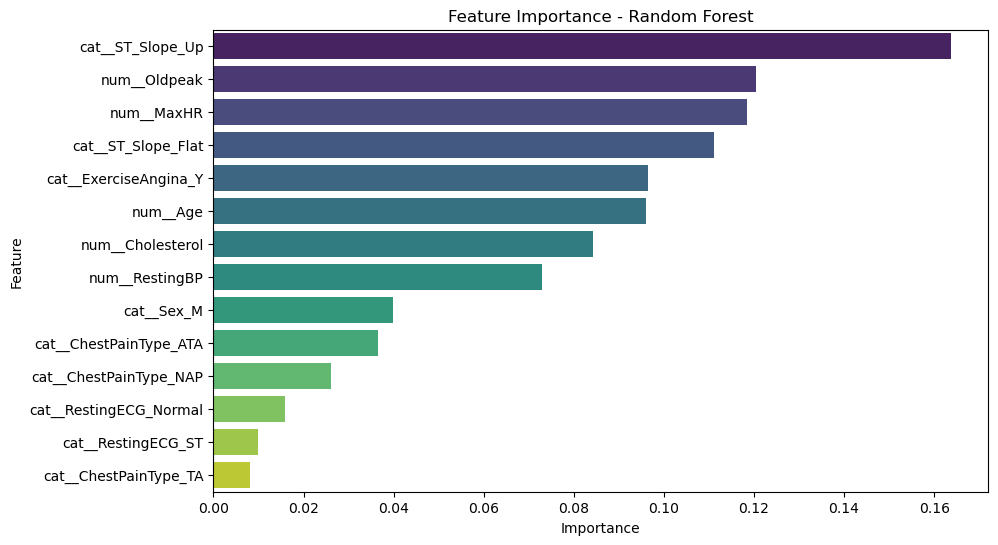

# **Heart Disease Prediction Project** 🏥

## **1. Introduction** 📌
Cardiovascular diseases (CVDs) have led to the deaths of over **18 million people globally**. This project aims to predict heart failure using machine learning models. The dataset consists of 11 features that represent various health metrics.

## **2. Dataset Overview** 📊
- **Number of Records:** 918
- **Number of Features:** 11 (Independent variables)
- **Target Variable:** `HeartDisease` (Binary classification: 0 = No, 1 = Yes)
- **Feature Types:**
  - **Numerical:** Age, RestingBP, Cholesterol, FastingBS, MaxHR, Oldpeak
  - **Categorical:** Sex, ChestPainType, RestingECG, ExerciseAngina, ST_Slope

## **3. Data Preprocessing** 🛠️
- **Handling Missing Values:** No missing values detected.
- **Handling Anomalies:**
  - `Cholesterol = 0` replaced with median cholesterol.
  - `RestingBP = 0` replaced with median blood pressure.
- **Feature Encoding:**
  - One-hot encoding applied to categorical variables.
- **Feature Scaling:**
  - Standardization applied to numerical features.

## **4. Exploratory Data Analysis (EDA)** 📈
- Distribution of heart disease cases analyzed using visualizations.
- Correlation analysis revealed key insights:
  - `MaxHR` and `Cholesterol` negatively correlated with heart disease.
  - `Age`, `FastingBS`, and `Oldpeak` positively correlated with heart disease.

## **5. Model Training and Evaluation** 🤖
### **Models Trained:**
1. **Random Forest Classifier**
2. **Logistic Regression**
3. **Decision Tree Classifier**
4. **Gradient Boosting Classifier**
5. **Support Vector Machine (SVM)**

### **Evaluation Metrics:**
- **Accuracy**
- **Precision, Recall, F1-Score**
- **Confusion Matrix Analysis**

### **Model Performance Results:** 📊
| Model                 | Accuracy | Precision (Macro Avg) | Recall (Macro Avg) | F1-Score (Macro Avg) |
|----------------------|----------|----------------------|----------------------|----------------------|
| **Random Forest**         | **85.87%**  | **85.42%**   | **85.67%**   | **85.53%**  |
| **Logistic Regression**   | 83.69%  | 83.35%   | 84.16%   | 83.50%  |
| Gradient Boosting        | 83.69%  | 83.21%   | 83.80%   | 83.41%  |
| SVM                      | 82.61%  | 82.26%   | 83.04%   | 82.40%  |
| Decision Tree            | 77.17%  | 77.08%   | 77.83%   | 77.00%  |

### **Confusion Matrix Analysis:** 🔍
| Model                | True Positives | True Negatives | False Positives | False Negatives | Conclusion |
|----------------------|---------------|---------------|----------------|----------------|-------------|
| **Random Forest**         | 93            | 65            | 12             | 14             | **Balanced model with high accuracy and low false negatives.** |
| **Logistic Regression**   | 87            | 67            | 10             | 20             | **Decent model but slightly weaker recall than Random Forest.** |
| **Decision Tree**         | 79            | 63            | 14             | 28             | **Overfitting issue likely. Performs worse than other models.** |
| **Gradient Boosting**     | 89            | 65            | 12             | 18             | **Good alternative model, but slightly higher false negatives.** |
| **SVM**                   | 86            | 66            | 11             | 21             | **Performs decently, but not the best model.** |

### **Best Model:** 🏆
- **Random Forest** performed the best with **85.87% accuracy** and the highest recall (85.67%), making it the most suitable model for identifying heart disease cases.

## **6. Hyperparameter Tuning** 🎛️
- Grid Search performed to optimize `C` (regularization strength) and solver type for Logistic Regression.
- Best parameters found:
  - `C = 0.1`
  - `solver = 'liblinear'`
- Tuned model improved generalization and maintained high accuracy.

## **7. Conclusion and Next Steps** 🚀
- **Key Takeaway:** Random Forest is the best-performing model.
- **Potential Improvements:**
  - Further hyperparameter tuning.
  - Feature engineering to extract more predictive information.
  - Deployment as a web-based application for real-time predictions.
 
  ### **Feature Importance Analysis:** 📊
Feature importance was analyzed using the **Random Forest** model. The top contributing factors to heart disease prediction are:

1. **ST_Slope_Up** - Most significant predictor
2. **Oldpeak** - Strong indicator of cardiac stress
3. **MaxHR** - Maximum heart rate achieved
4. **ST_Slope_Flat** - Another key ST slope pattern
5. **ExerciseAngina_Y** - Presence of exercise-induced angina
6. **Age** - Age plays a major role in risk assessment
7. **Cholesterol** - Cholesterol levels impact heart health
8. **RestingBP** - Blood pressure levels contribute to cardiovascular risk

The full feature importance distribution is visualized below:

This project successfully built a predictive model for heart disease using machine learning techniques and data preprocessing strategies.
